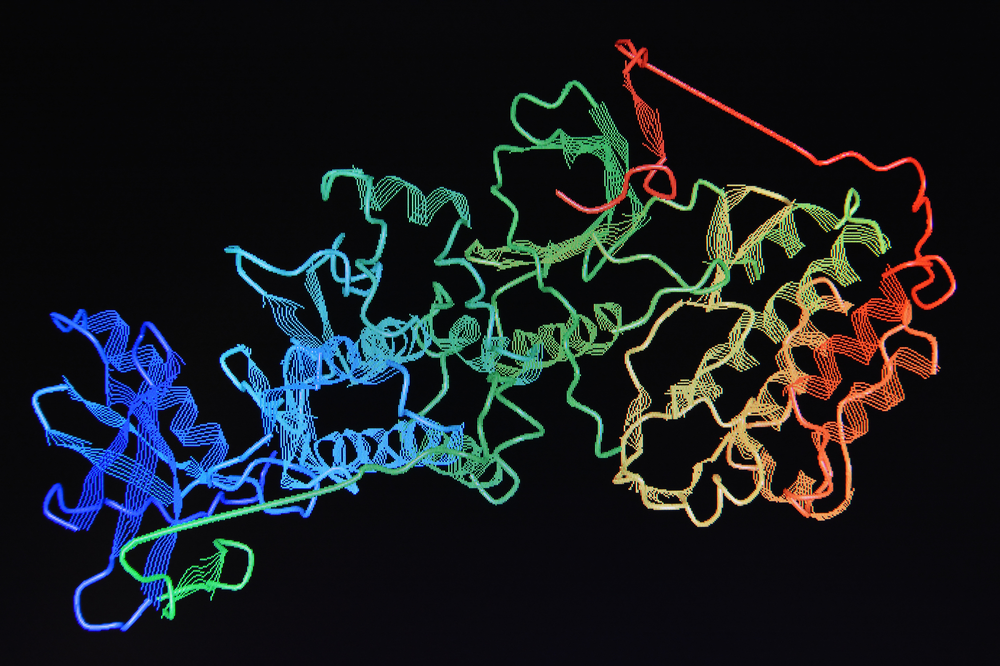

# Classifying Proteins From The Amino Acid Code

## 1. Business Understanding

#### Proteins are essential biomolecules composed of amino acid chains, ranging from 44 to 27,000 amino acids in length. While much is understood about proteins, ongoing research continues to unveil new ones. They play crucial roles in structural, regulatory, and enzymatic processes within the human body, and studying them has been pivotal in comprehending various bodily functions and degradation pathways. One significant challenge in elucidating a protein's function is its classification. Identifying the protein family to which a novel protein belongs aids in understanding evolutionary relationships and assessing its overall function. By leveraging amino acid sequence and residue data, the modeling process aims to classify proteins into their respective families, facilitating the unraveling of their functions. With potential application in various fields, including drug discovery, biotechnology, and personalized medicine.

## 2.Data Overview

#### The data utilized in this project was downloaded from Kaggle and sourced from the Research Collaboratory for Structural Bioinformatics (RCSB) Protein Data Bank (PDB). The dataset included 2 dataframes with 141,401 and 467,304 entries, respectively. After extensive data manipulation 144,378 entries were left including target proteins. As mentioned above the input features were residue count and amino acid sequence. Files can be directly downloaded from the following link: https://www.kaggle.com/datasets/shahir/protein-data-set/code?datasetId=11797&sortBy=voteCount

#### - files names: pdb_data_no_dups & pdb_data_seq
#### - from Data Folder in repository

## 3. Data Preparation

#### Several steps were taken to adequately prepare the raw data for modeling. Both data frames were merged using an inner join and outer join. Ultimately, the inner joined dataframes were used for modeling because it represented a common cross section between both dataframes without generating additional rows containing null values. The remaining null values were also dropped in addition to any columns not pertinent for modeling. Finally, the data was subsetted to only contain proteins in the 'macromolecule_Type_x' column. 

.png)

#### The 5 most frequent proteins were used as target features primarily to simplify the modeling process. There are 4,468 unique values for proteins in the 'classification' column which would increase the overall complexity of the modeling process. In addition to this there were a number of unique proteins with a value of one which would not be adequate for training due to a massive class imbalance between the top 5 occuring proteins and the single count proteins.

.png)

####  Most amino acid sequences are 500 and below in length. This gives an overall picture of the length and complexity of the amino acid sequences in the dataset and helps to assess how to incorporate these sequences in the modeling process. Amino acids can be handled as text and can be analyzed using classic NLP methods, such as bag-of-words, k-mers/n-grams and text search, as well as modern techniques such as word embedding, contextualized embedding, deep learning and neural language models. Approaches such as one hot encoding can be utilized as well, but based on the size of the amino acid sequence lengths in the above chart it could generate far too many columns and be difficult to deal with for analysis. The most practical option at the moment is Label Encoding which assigns a unique value to each sequence present in the data set.

#### Handling Sequence Data - https://www.sciencedirect.com/science/article/pii/S2001037021000945

## 4. Data Modeling

### Initial Modeling

#### In addition to the Dummy Model several untuned models were tested to look at the Accuracy and Validation scores to test the efficacy and fit of the models.
 
##### Dummy Model
.png)
##### KNN
.png)
##### Validation Accuracy: 79%  Training Accuracy: 87% 
##### This model is very overfit and has an inadequate accuracy score on the validation data

##### Decision Tree
.png)
##### Validation Accuracy: 91%  Training Accuracy: 99%
##### This model is overfit and has a much better accuracy score on the validation data

##### Random Forests
.png)
##### Validation Accuracy: 91%  Training Accuracy: 99%
##### This model is overfit the accuracy score on the validation data did not change in comparison to the Decision Tree Model

##### Extra Trees
.png)
##### Validation Accuracy: 92%  Training Accuracy: 99%
##### The model remains overfit with a slight improvement in the validation accuracy score this is the best model and will be tuned for a better fit in the data

## 5. Evaluation 

.png)

#### The metric used for evalution was accuracy. This metric assesses the efficacy of my model by looking at the amount of data points that were predicted correctly. In the final confusion matrix after tuning my model and comparing the validation and test sets. The final accuracy between both was about 92%. Despite this high accuracy there were a fair amount of data points that were not predicted correctly. The incorrect predictions that stand out were the 387 predictions where hydrolase was incorrectly predicted as transferase as well as the 218 instances of hydrolase being predicted as oxidireductase. There were aslo 184 instances of Hydrolases being predicted ad Immunoglobulins, 354 instances of transferases predicted as hydrolases, 156 instances of oxioreductases predicted as hydrolases, 122 instance of oxioreductases predicted as transferases and finally 166 instances of transferases being predicted as oxioreductase. Despite the high amount of correct predictions I wouldn't feel comfortable deploying such a model in an industry setting. Science is a field highly dependent on precision and accuracy and if there is no other way to further weed out the incorrect predictions I would not feel comfotable using this model.  

## 6. Next Steps

#### (1) Conduct comparative analysis between sequences to see if similarities between amino acid sequences could lead to incorrect predictions.

#### (2) Use other input features to see if an effective prediction model can still be built without sequence or residue data.

#### (3) Create and unsupervised neural net to analyze sequence data.

## 7. Repo Structure

├── Data
├── Images
├── Notebooks
├── presentation
├── Final_Notebook
└── README.md